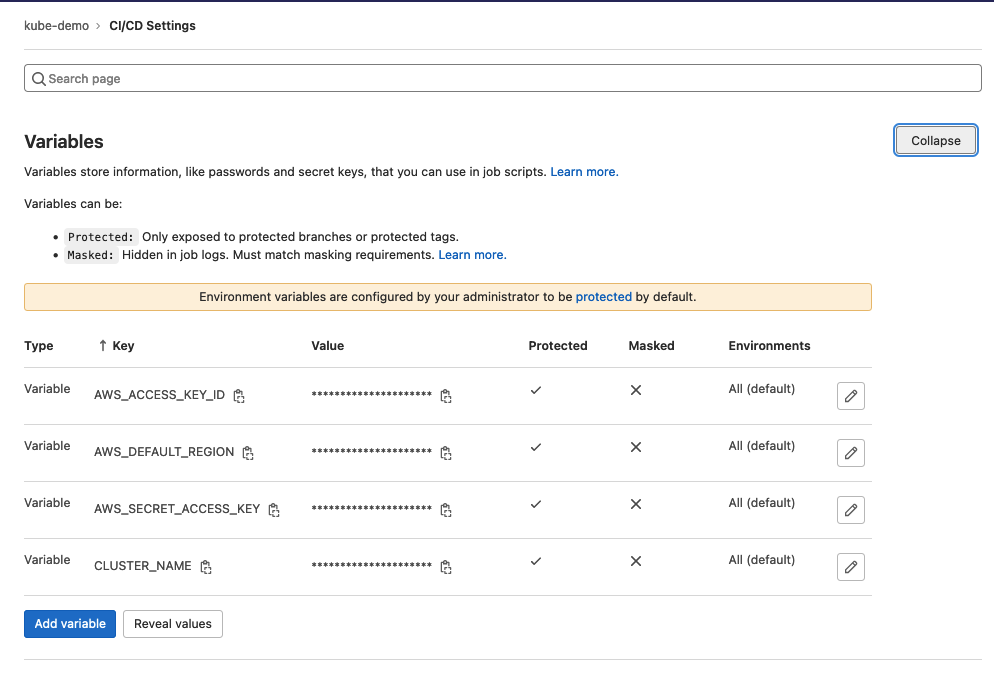
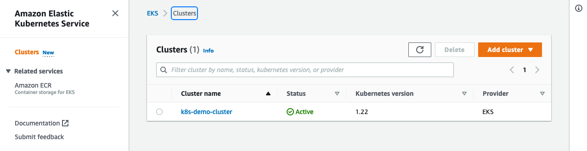
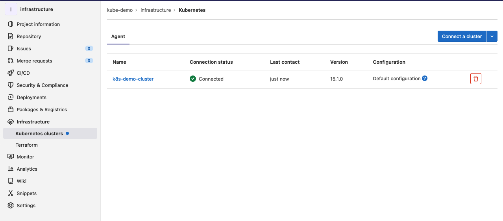
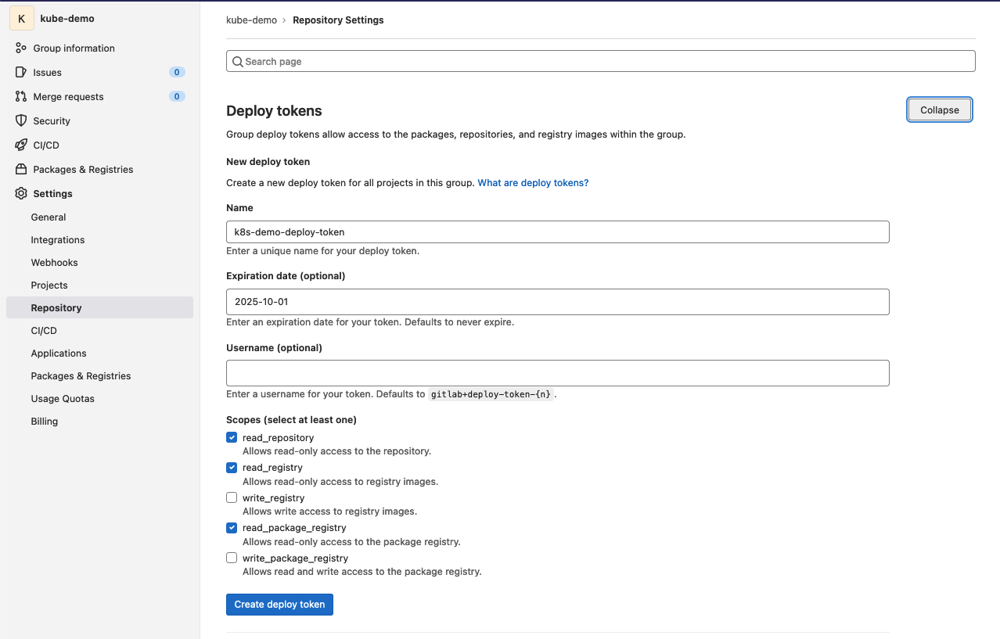
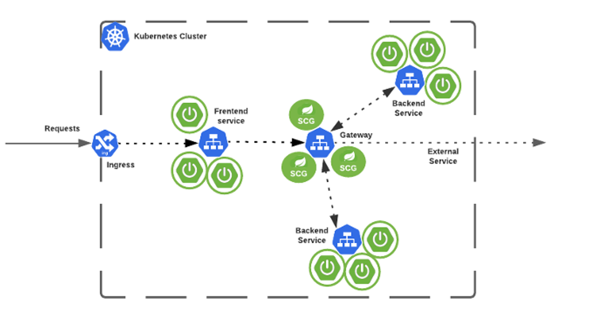

# Infrastructure

To use Docker Desktop go here: [local config](#local-config)

## Setup

Login or Create an AWS account - _make sure to locate your credentials_

Login or Create a Pulumi account

Login or Create Gitlab account

Create a **group** in your Gitlab account (I will refer to my **group** as `kube-demo` from here on)

- Set up AWS credentials ( k8s-demo/Settings/CICD )

    - _***NOTE:***_ CLUSTER_NAME can found in [./pulumi/index.ts](./pulumi/index.ts) -- mine is set to `k8s-demo-cluster`

Fork the this repo: [infrastructure](https://gitlab.com/kube-demo/infrastructure) into your **group**

---
### Repo Overview
- [eks cluster code](./pulumi/index.ts)
- [Spring Cloud Gateway files](./spring-cloud-gateway-k8s-1.1.5/)
- [Dockerfile](./Dockerfile)
- [Gateway Config](./gateway-config.yml)
- [Ingress Config](./ingress-config.yml)
- [Gitlab CI](./.gitlab-ci.yml)

## Create Cluster
```bash
$ cd pulumi
$ pulumi up
```
if everything looks good, select `yes` and continue. Alternatively you can use ``` pulumi up -y``` to bypass this menu.

_This will take a while... you can go to aws console and watch your cluster_



---
## Setup Cluster for Devops
### Make sure CLIs are installed locally

[Install kubectl](https://kubernetes.io/docs/tasks/tools/)

[Install helm](https://helm.sh/docs/intro/install/#from-homebrew-macos)

### Set Context for kubectl cli

update kubeconfig
```bash
$ aws eks --region us-east-1 update-kubeconfig --name k8s-demo-cluster
Added new context arn:aws:eks:us-east-1:00000000000:cluster/k8s-demo-cluster to /Users/my-user/kube-demo/infrastructure/pulumi/kubeconfig-admin.json
```
set-context on kubectl cli from output arn
```bash
$ kubectl config set-context arn:aws:eks:us-east-1:00000000000:cluster/k8s-demo-cluster
Context "arn:aws:eks:us-east-1:000000000000:cluster/k8s-demo-cluster" modified.
```
Run a kubectl command to verify context
```bash
$ kubectl get all
NAME                 TYPE        CLUSTER-IP   EXTERNAL-IP   PORT(S)   AGE
service/kubernetes   ClusterIP   XXX.XX.X.X   <none>        443/TCP   26m
```

[Helpful commands](#helpful-kubectl-commands)

### Add Gitlab Agent to Kubernetes Cluster
In the infrastructure repo 
1. click the Infrastructure tab
2. Click "Connect a cluster" button
3. Type in a name
4. Click "Register"
5. copy the command that looks similar to this

    ```bash
    helm repo add gitlab https://charts.gitlab.io
    helm repo update
    helm upgrade --install k8s-demo-cluster gitlab/gitlab-agent \
        --namespace gitlab-agent \
        --create-namespace \
        --set image.tag=v15.1.0 \
        --set config.token=<your-config-token>\
        --set config.kasAddress=wss://kas.gitlab.com
    ```

When complete it should look like this:



---
## Authenticate Gitlab Registry in Cluster 

Before we can run any CICD we need a registry to hold our images.

When using Gitlab registry we need to configure our EKS cluster to authenticate with our registry to have rights to pull our images.

### Create deploy token in Gitlab
In your gitlab **group**, go to the `Settings` tab and `Repository` tab under that, then create a token. Take note of `token` and `token-username`



We are creating a secret in our cluster and we must specify a `name`. When a configuration is applied, (we will see later), we need to reference this `name` so that our cluster can reference the credentials to authenticate with our gitlab registry. 

```bash
$ kubectl create secret docker-registry <insert-secret-name> \
    --docker-username="<token-username>" \
    --docker-password="<token>" \
    --docker-email="your@email.com" \
    --docker-server="registry.gitlab.com"
secret/<insert-secret-name> created
```

_note: the `insert-secret-name` will be what we reference in deploy ymls and we must use the same name not the deploy `token-username` (unless they are the same value)_

## Infrastructure Image
We need to create a base image for our deployments that has all of our tools (aws, kubectl, etc..)
This repo has a [Dockerfile](./Dockerfile) that does just that.

in our [.gitlab-ci.yml](./.gitlab-ci.yml) we are creating pipeline to create this image in our gitlab registry

```yml
build:
  image: docker:20
  stage: build
  services:
    - docker:dind
  before_script:
    - echo "$MY_NAME"
    - echo $CI_BUILD_TOKEN | docker login -u "$CI_REGISTRY_USER" --password-stdin $CI_REGISTRY
  script:
    - docker build --pull -t "$CI_REGISTRY_IMAGE":"$CI_PIPELINE_IID" .
    - docker push "$CI_REGISTRY_IMAGE":"$CI_PIPELINE_IID"
    - docker tag "$CI_REGISTRY_IMAGE":"$CI_PIPELINE_IID" "$CI_REGISTRY_IMAGE":"latest"
    - docker push "$CI_REGISTRY_IMAGE":"latest"
  when:
    manual
```

_note: This is a **manual** job, so you will have to go to gitlab to click the job to run it -- see image below_


Here is where you can find the location of your container


## Spring Cloud Gateway
### Setup
[Docs](https://docs.vmware.com/en/VMware-Spring-Cloud-Gateway-for-Kubernetes/1.1/scg-k8s/GUID-installation-helm.html)

We already have the [files](./spring-cloud-gateway-k8s-1.1.5/) for spring cloud gateway we should start with the relocate script

Login in to docker on your personal account

```bash
$ ./spring-cloud-gateway-k8s-1.1.5/scripts/relocate-images.sh <account_name> 
```
```bash
$ ./spring-cloud-gateway-k8s-1.1.5/scripts/install-spring-cloud-gateway.sh
Release "spring-cloud-gateway" does not exist. Installing it now.
W0707 10:17:01.029773   89482 warnings.go:70] spec.template.spec.containers[0].resources.requests[memory]: fractional byte value "512m" is invalid, must be an integer
NAME: spring-cloud-gateway
LAST DEPLOYED: Thu Jul  7 10:16:58 2022
NAMESPACE: spring-cloud-gateway
STATUS: deployed
REVISION: 1
TEST SUITE: None
NOTES:
This chart contains the Kubernetes operator for Spring Cloud Gateway.
Install the chart spring-cloud-gateway-crds before installing this chart

Checking Operator pod state 
deployment "scg-operator" successfully rolled out
✔ Operator pods are running

Checking custom resource definitions 
✓ springcloudgatewaymappings.tanzu.vmware.com successfully installed
✓ springcloudgatewayrouteconfigs.tanzu.vmware.com successfully installed
✓ springcloudgateways.tanzu.vmware.com successfully installed

Successfully installed Spring Cloud Gateway operator 
```
Verify
```bash
$ kubectl get ns
NAME                   STATUS   AGE
default                Active   132m
gitlab-agent           Active   91m
kube-node-lease        Active   132m
kube-public            Active   132m
kube-system            Active   132m
spring-cloud-gateway   Active   2m7s
```
```bash
$ kubectl get all -n spring-cloud-gateway
NAME                                READY   STATUS    RESTARTS   AGE
pod/scg-operator-57c64dbf95-86rqj   1/1     Running   0          2m34s

NAME                   TYPE        CLUSTER-IP      EXTERNAL-IP   PORT(S)   AGE
service/scg-operator   ClusterIP   172.20.38.139   <none>        80/TCP    2m35s

NAME                           READY   UP-TO-DATE   AVAILABLE   AGE
deployment.apps/scg-operator   1/1     1            1           2m34s

NAME                                      DESIRED   CURRENT   READY   AGE
replicaset.apps/scg-operator-57c64dbf95   1         1         1       2m34s
```
### Configure
Basic Configuration for a gateway
```yml
# gateway-config.yml
apiVersion: tanzu.vmware.com/v1
kind: SpringCloudGateway
metadata:
  name: cluster-gateway
--- 
```
### Deploy
```bash
$ kubectl apply -f gateway-config.yml
```
_note:_ if needed use "delete" to takedown

---
## Ingress
### Setup
Create basic config for contour ingress
```bash
$ kubectl apply -f https://projectcontour.io/quickstart/contour.yaml
```
### Configure
```yml
# ingress-config.yml
apiVersion: networking.k8s.io/v1
kind: Ingress
metadata:
  name: cluster-ingress
  labels:
    app: cluster-gateway # links to gateway metadata name
  annotations: 
    kubernetes.io/ingress.class: contour 
spec:
  rules:
    - http:
        paths:
          - path: /api # every route prefixed with "api" goes to gateway
            pathType: Prefix
            backend:
              service:
                name: cluster-gateway # links to gateway metadata name
                port:
                  number: 80
          - path: / # route to frontend service
            pathType: Prefix
            backend:
              service:
                name: frontend-api-lb # links to frontend service metadata name
                port:
                  number: 80
```

Now when we can deploy our service to our cluster we have a base image that can process our scripts -- See next section

### Deploy

```bash
$ kubectl apply -f ingress-config.yml
```

## Deploy a Service to Cluster

If you have not done this section yet: Fork this [repo](https://gitlab.com/kube-demo/cart) and put in your **group**

Follow directions in [repo's Deploy section](https://gitlab.com/kube-demo/cart#deploy) for deployment

### Finish rolling out the other services
Fork these repos into your **group**
- infrastructure *_should already be forked_
- cart *_should already be forked_
- [frontend](https://gitlab.com/kube-demo/frontend)
- [products](https://gitlab.com/kube-demo/products)
- [users](https://gitlab.com/kube-demo/users)

Follow READMEs in service repos for more details
---
## Resources
### Infrastructure Diagram

This is a basic pattern for this demo cluster


---
### Docs
- [Kuberenetes](https://kubernetes.io)
- [Contour Ingress](https://projectcontour.io/)
- [Spring Cloud Gateway](https://docs.vmware.com/en/VMware-Spring-Cloud-Gateway-for-Kubernetes/1.1/scg-k8s/GUID-getting-started.html
)

### Local Config
You can follow this repo and run on Docker Desktop instead. 
Things to note
1. No need for Pulumi as Docker Desktop has the cluster configured
2. Set your kubeconfig to docker-desktop ```kubectl config use-context docker-desktop```
3. test to make sure you get output ```kubectl get all```
4. If you are pulling docker images from gitlab make sure to configure docker secrets
5. Follow the steps to setup spring cloud gateway and contour ingress
6. Run ad hoc commands from your apis to apply the ymls. ```kubectl appy -f app-deploy.yml```
7. if having issues with deploy, you may need to configure docker pull secrets for your container registry or comment out the line if you are pulling from local docker registry or you own docker hub.

### Helpful kubectl Commands 
[Docs for cli](https://kubernetes.io/docs/reference/kubectl/)
```bash
kubectl apply -f file 
kubectl delete -f file 
kubectl get ns # namespace
kubectl get events [-n <namespace> ]
kubectl get all [-n <namespace> ]
```